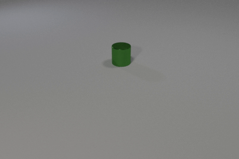
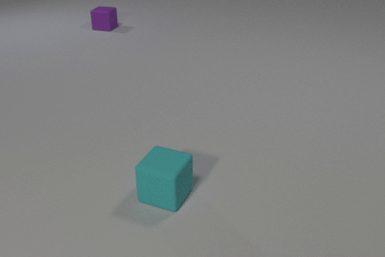

# FrameReason

## 基于 Qwen3-VL 的视频理解与可验证奖励后训练：技术报告

FrameReason 研究一个具体问题：在单卡 RTX 3090 24GB 条件下，先用监督微调让视觉语言模型适应 CLEVRER 视频问答，再用可验证奖励进行 GRPO，能否继续提高答题正确率？项目以 Qwen3-VL-4B-Instruct 为基座，通过 ms-swift 完成数据转换、八帧输入、LoRA SFT、GRPO 和同题对照评测。

在 seed42 的固定 800 题内部测试集上，Base、SFT700、GRPO3000 分别答对 343、609、606 题。SFT 相比 Base 提高 33.250 个百分点；GRPO 纠正 59 题、丢失 62 题，没有获得额外净收益。本仓库发布最小任务代码、历史结果复核材料和视频问答 Demo，保留正结果与负结果。

| 版本 | 答对题数 | 答案正确率 |
| --- | ---: | ---: |
| Qwen3-VL-4B-Instruct | 343 / 800 | 42.875% |
| LoRA SFT，checkpoint 700 | 609 / 800 | 76.125% |
| SFT + GRPO，checkpoint 3000 | 606 / 800 | 75.750% |

这是单 seed、自定义平衡子集的结果，不是 CLEVRER 官方隐藏测试榜单。源码整理后的 CPU 检查与原实验的 GPU 训练结果分别记录，不以单元测试代替模型效果验证。

## 1. 视频与回答 Demo

克隆仓库后，无需模型、GPU 或教师 API，即可观看十段真实视频及三组已保存的回答：

```bash
git clone https://github.com/HuanYn/-FrameReason.git
cd -- -FrameReason
python -m http.server 8766 --bind 127.0.0.1 --directory demo
```

浏览器打开 `http://127.0.0.1:8766/`。页面支持题型筛选、视频切换、标准答案显示及原始结构化回答展开。播放器使用 VP8/WebM，另为下述两个案例提供完整 GIF 备用播放。GitHub 文件页不会运行 HTML，请使用本地服务；README 中的动图可直接查看。

### 案例 A：GRPO 纠正一题

视频 `video_11060`，问题 Q9：**一共发生了多少次碰撞？**



| 原模型 | SFT700 | GRPO3000 | 官方答案 |
| --- | --- | --- | --- |
| 2，错误 | 2，错误 | 1，正确 | 1 |

### 案例 B：GRPO 丢失一题

视频 `video_10317`，问题 Q1：**有多少个圆柱体在运动？**



| 原模型 | SFT700 | GRPO3000 | 官方答案 |
| --- | --- | --- | --- |
| 0，正确 | 0，正确 | 1，错误 | 0 |

两段动图均由 CLEVRER 原视频转码，不是模型生成视频。模型当时实际输入的是同视频均匀采样的八张图片。Demo 的三列来自历史评测，中文题干仅是展示译文，不是重新生成的回答。

十个样例是有意挑选的讲解案例：四种题型各取两个 Base 与 SFT 答案不同的样例，再加入原顺序最早的一题 GRPO 纠正和一题 GRPO 丢失。因此不从 Demo 的样例正确率推导整体性能。更多说明见 [Demo 案例](docs/demo-examples.md)。

## 2. 任务与数据

[CLEVRER](https://clevrer.csail.mit.edu/) 是由简单物体运动与碰撞组成的视频问答数据集，覆盖描述、解释、预测和反事实四类问题。描述题输出短答案；其他题型输出选项编号集合，允许多选和空集合。本项目使用官方标注生成监督目标与评分参考，不使用教师模型生成 ground truth。

| 数据划分 | 来源与规则 | 题目数 | 每题型数量 |
| --- | --- | ---: | ---: |
| train | 官方 train，先按 video_id 划分 | 12,000 | 3,000 |
| dev | 官方 train，视频级隔离 | 2,000 | 500 |
| 内部父 test | 官方 validation | 4,000 | 1,000 |
| 最终 compact800 | 父 test 内固定抽样 | 800 | 200 |

划分使用 seed42 的确定性哈希。先划分视频，再应用各题型数量上限，避免同一视频跨 train、dev、test。最终 800 题使用题型、video_id、question_id 的哈希排序选取，不依据答案或模型表现选题；精确题目键见 [subset800.jsonl](results/subset800.jsonl)。

800 道题对应 754 个不同视频，并非每道题都来自独立视频。同视频问题之间可能相关。视频隔离也不能证明基础模型在预训练时没有接触过 CLEVRER。

## 3. 方法

### 3.1 八帧视觉输入与结构化输出

输入链路是：原视频 → 包含首尾的均匀八帧 → Qwen3-VL 图像与文本模板 → 结构化回答。系统提示、英文问题及公开选项是模型输入；正确答案、问题程序和选项程序仅用于训练目标或外部评分。

输出接口为：

```text
<trace>{"question_type": "...", "question_program": [...],
"selected_choice_ids": [...], "selected_choice_programs": [{"choice_id": 0, "program": [...]}]}</trace><answer>...</answer>
```

这里的 trace 是 CLEVRER 公共功能程序的结构化表示。程序匹配只是对照标注检查 JSON 内容，没有执行物理模拟，也不证明模型内部推理过程正确。解析器检查标签封装、重复 JSON 键和非法值；奖励的一致性检查再校验程序及选项结构，二者不是同一个指标。

### 3.2 LoRA SFT

基座为官方 `Qwen/Qwen3-VL-4B-Instruct`，它已完成官方指令训练，但未进行本项目的 CLEVRER 微调。项目冻结视觉编码器与视觉对齐模块，在语言部分的线性层加入 rank 8、alpha 16 的 LoRA，使用 BF16 训练。这里没有使用 4-bit QLoRA。

SFT 以官方标注构造的规范 trace 与 answer 为监督目标。正式训练执行 750 个优化步骤，在保留的 checkpoint 700 和 750 上比较 dev，选择 700。两者在 2000-dev 上分别答对 1509 和 1503 题。

### 3.3 GRPO 与可验证奖励

GRPO 从 SFT700 的适配器初始化，每题生成四个候选，分别计算规则奖励：

$$
R = \operatorname{clip}_{[0,1]}\left(0.1F + 0.5C + 0.4P - 0.1L\right).
$$

其中，$F$ 为输出格式合法，$C$ 为答案正确，$P$ 为完整标注程序匹配，$L$ 为重复或过长惩罚。答案分项和程序分项独立计算，因此答案错误但程序匹配的输出仍可能获得部分奖励。奖励不是答案正确率。

组内优势由同题候选的奖励相对差异产生：

$$
A_i = \frac{R_i-\overline{R}}{s_R+10^{-4}}.
$$

$s_R$ 为同题奖励的样本标准差。四个奖励相同时，所有优势均为零；稳定项只能避免除零，不能创造候选之间的学习信号。本次配置 `beta=0`，没有 KL 惩罚项；不能将实验结果归因于 KL 约束。

## 4. 实验设置

| 配置 | SFT | GRPO |
| --- | --- | --- |
| 视觉输入 | 均匀八帧 | 均匀八帧 |
| 精度 / 注意力 | BF16 / SDPA | BF16 / SDPA |
| LoRA rank / alpha | 8 / 16 | 8 / 16 |
| 冻结模块 | ViT、aligner | ViT、aligner |
| 单设备 batch | 1 | 1 |
| 梯度累积 | 16 | 4 |
| 学习率 | 1e-4，恒定 | 1e-5，恒定 |
| 训练步数 | 750，dev 选择 700 | 固定 3000 |
| 候选数 / 采样温度 | 不适用 | 4 / 0.9 |
| GRPO iterations / steps_per_generation | 不适用 | 1 / 4 |
| 最大序列长度 | 2048 | 2048 |
| 最大生成长度 | 不适用 | 320 tokens |
| checkpoint 间隔 | 50 步 | 50 步 |
| seed / data_seed | 42 / 42 | 42 / 42 |

历史运行使用 RTX 3090 24GB。记录的环境为 Python 3.11.11、PyTorch 2.6.0+cu124、Transformers 4.57.3、ms-swift 4.5.2、PEFT 0.19.1、TRL 0.29.1。基座 revision 为 `ebb281ec70b05090aa6165b016eac8ec08e71b17`。历史 ms-swift 是可编辑安装的开发版本，原 GRPO 训练提交为 `89e4bcda66583b43fdb5e35cc5dca9cee241f123`；同名 PyPI 版本不能被视为该工作树的完整替代。

最终评测固定八帧、batch 1、最多 320 个生成 token，每题贪心生成一次，不对畸形回答重试。GRPO3000 在本次 dev/test 之前固定，不依据最终 800 题结果挑选 checkpoint。SFT 与 GRPO 的选模机会不同，需要结合这一点理解 dev 比较。

## 5. 结果

### 5.1 分题型结果

每种题型固定 200 题，下表均为答对题数。

| 题型 | Base | SFT700 | GRPO3000 | GRPO 相比 SFT |
| --- | ---: | ---: | ---: | ---: |
| 描述 | 108 | 153 | 160 | +7 |
| 解释 | 45 | 163 | 156 | -7 |
| 预测 | 151 | 185 | 182 | -3 |
| 反事实 | 39 | 108 | 108 | 0 |
| 总计 | 343 | 609 | 606 | -3 |

GRPO 的描述题改善被其他题型的损失抵消。与 SFT 配对后，两者都正确 547 题、都错误 132 题，GRPO 纠正 59 题、丢失 62 题。共有 121 题的正确性发生变化，因此不能说模型完全没有变化。

### 5.2 答案、格式和程序分别计分

| 指标 | Base | SFT700 | GRPO3000 |
| --- | ---: | ---: | ---: |
| 格式合法 | 800 / 800 | 800 / 800 | 800 / 800 |
| 完整程序匹配 | 0 / 800 | 656 / 800 | 644 / 800 |
| 答案与程序联合成功 | 0 / 800 | 609 / 800 | 605 / 800 |

Base 可以给出正确答案，却不满足规定的内部程序结构。不能因为程序匹配为零，就将其答案正确率也记为零。格式合法率已经是 100%，增加对所有候选相同的格式奖励也不能消除同分问题。

机器可读结果见 [metrics.json](results/metrics.json)。公开逐题记录可复核计数和配对关系；独立对照全部官方标注重新评分，还需要从官方数据生成评分参考。两者的区别见 [复现范围](docs/reproduction-scope.md)。

## 6. GRPO 未获额外收益的诊断

原训练日志包含 3000 个有效四候选组。其中 2659 组奖励相同，占 88.633%；这些组的记录优势全部为零，标量日志也有 2659 步 `grad_norm=0`。发布的分组记录见 [training-groups.jsonl](results/training-groups.jsonl)。

这说明组内奖励缺乏区分度是本次运行的一个明确瓶颈。全对题可能已没有继续区分的空间；全错题则可能是视觉证据不足、任务能力不足，或所有错误候选受到相同评分。答案文本不同，也可能得到相同奖励。

这些观察不能证明同分是未涨点的唯一原因。零梯度也不保证带动量或权重衰减的优化器绝对不更新参数。训练达到 3000 步、loss 接近零或训练奖励较高，都不能单独证明收敛或泛化改善。

后续探索曾尝试教师辅助补强与教师资格验证，但没有建立额外学生净收益。Video-OPD 的学生训练未执行。这些探索不混入原 SFT700 / GRPO3000 的主结果，也不作为已完成的有效方法发布。

## 7. 最小复现

本仓库区分三个层次：观看历史 Demo、CPU 复核已发布记录、用自行准备的数据与模型重新执行训练流程。前两个不需要 GPU。第三个需要训练资源，新的运行结果不保证与历史结果逐 bit 或逐题相同。

### 7.1 CPU 检查与结果复核

```bash
python -m pip install -e .
python -m unittest discover -s tests -v
python -m unittest discover -s results -p "test_*.py" -v
python results/verify_results.py
```

检查内容包括输出解析、奖励分项、视频级数据划分、采样与评分接口，以及发布记录中的总计、分题型计数、配对变化和同分组比例。CPU 检查不会下载模型或启动训练。本次发布的 29 项 CPU 检查、干净 Git 归档与 Demo 检查记录见 [发布验证](docs/release-checks.md)。

### 7.2 数据与模型准备

从 [CLEVRER 官方页面](https://clevrer.csail.mit.edu/)取得 train/validation 的 Questions and Answers 与原视频，从 [Qwen 官方模型页](https://huggingface.co/Qwen/Qwen3-VL-4B-Instruct)准备固定 revision 的模型。训练数据、模型和输出目录应位于足够大的数据盘，而不是系统盘。

数据转换和抽帧入口：

```bash
python -m framereason.convert_clevrer --help
python -m framereason.extract_frames --help
```

转换器负责官方 schema、视频隔离和规范监督目标；抽帧器根据 manifest 确定性提取八帧。下载得到的视频可能分布在多个子目录，应按转换器的输入约定整理。完整命令见 [逐步复现](docs/quickstart.md)，历史记录的边界见 [复现范围](docs/reproduction-scope.md)。

### 7.3 SFT、GRPO 与新预测评分

GPU 环境依赖见 [requirements-train.txt](requirements-train.txt)。它记录主要版本配方，不是包含全部间接依赖与历史开发补丁的完整环境锁。先安装与驱动兼容的 PyTorch CUDA 版本，再安装记录的训练依赖；仓库不自动安装或升级 GPU 驱动。

```bash
python -m framereason.launch sft --help
python -m framereason.launch grpo --help
python -m framereason.infer --help
python -m framereason.evaluate --help
```

训练与推理入口默认仅展示计划。真正执行需要显式指定执行选项、GPU 编号及预期身份，并通过空闲卡检查。先完成 SFT 并在 dev 上选模，再从选定 SFT 适配器初始化 GRPO；评测 GRPO 时加载最终 actor 适配器，不叠加旧 SFT 适配器。

本次发布只验证便携代码的 CPU 行为、数据记录与 Demo，没有重新执行完整 GPU 训练。旧实验中的云平台调度、账号凭据、迁移脚本和机器专属恢复封装不属于最小复现包。

## 8. 仓库内容与复现限制

| 目录 | 内容 |
| --- | --- |
| `framereason/` | 数据转换、抽帧、输出解析、奖励、训练与推理入口、评分 |
| `configs/` | 便携的 SFT / GRPO 参数 |
| `tests/` | 不依赖 GPU 的回归检查 |
| `results/` | 固定 800 题的历史结果、精确题目键与训练组诊断 |
| `demo/` | 静态视频及三模型回答演示 |
| `docs/` | 案例说明、代码来源和复现边界 |

不包含基座权重、训练适配器、优化器状态、完整 CLEVRER 数据、包缓存或私有服务信息。没有这些资产，就不能仅凭克隆仓库进行即时模型推理或承诺精确还原训练状态。

本项目尚未建立多 seed 稳定性、统计显著性、官方榜单成绩或通用物理因果推理能力的证据。固定测试集已用于结果查看与错题复盘，不应再次当作未曝光的新确认集。该最小发布聚焦可阅读、可核对、可重新运行的方法实现。

## 9. 来源与许可

代码采用 [Apache License 2.0](LICENSE)。CLEVRER 官方数据 README 明确采用 CC0；Demo 中的视频与题目注明原始来源。模型、框架与其他依赖遵循各自条款，详见 [第三方说明](THIRD_PARTY_NOTICES.md)。

- Yi et al. *CLEVRER: CoLlision Events for Video REpresentation and Reasoning*. ICLR 2020. [项目与论文入口](https://clevrer.csail.mit.edu/)。
- Qwen 团队：[Qwen3-VL-4B-Instruct 模型卡](https://huggingface.co/Qwen/Qwen3-VL-4B-Instruct)。
- ModelScope：[ms-swift 训练框架](https://github.com/modelscope/ms-swift)。
- [CLEVRER 官方数据格式与 CC0 说明](https://data.csail.mit.edu/clevrer/README.txt)。
